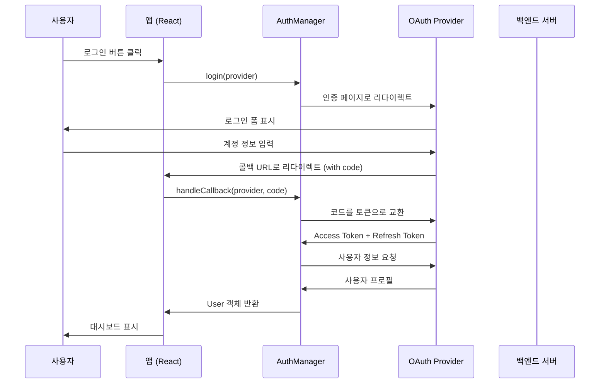

# 인증 플로우 다이어그램

## 📊 OAuth 2.0 인증 플로우



## 🔄 컴포넌트 상호작용 플로우

```
┌─────────────────────────────────────────────────────────┐
│                      사용자 인터페이스                    │
├─────────────────────────────────────────────────────────┤
│                                                         │
│  ┌──────────────┐        ┌──────────────┐             │
│  │ LoginButton  │        │ AuthCallback  │             │
│  └──────┬───────┘        └──────┬───────┘             │
│         │                        │                      │
│         ▼                        ▼                      │
│  ┌──────────────────────────────────────┐              │
│  │            useAuth Hook              │              │
│  └──────────────┬───────────────────────┘              │
│                 │                                       │
├─────────────────┼───────────────────────────────────────┤
│                 ▼                                       │
│  ┌──────────────────────────────────────┐              │
│  │          AuthManager (싱글톤)         │              │
│  └──────────────┬───────────────────────┘              │
│                 │                                       │
│         ┌───────┴───────┐                              │
│         ▼               ▼                              │
│  ┌────────────┐  ┌────────────┐                       │
│  │ GoogleOAuth│  │ KakaoOAuth │                       │
│  │  Provider  │  │  Provider  │                       │
│  └────────────┘  └────────────┘                       │
│                                                         │
├─────────────────────────────────────────────────────────┤
│                      상태 관리                          │
├─────────────────────────────────────────────────────────┤
│                                                         │
│  ┌──────────────────────────────────────┐              │
│  │       Zustand Store (authStore)      │              │
│  │  - user: User | null                 │              │
│  │  - isAuthenticated: boolean          │              │
│  │  - isLoading: boolean                │              │
│  │  - error: string | null              │              │
│  └──────────────────────────────────────┘              │
│                                                         │
└─────────────────────────────────────────────────────────┘
```

## 🎯 주요 함수 호출 흐름

### 1. 로그인 프로세스

```typescript
// 1단계: 사용자가 로그인 버튼 클릭
<LoginButton provider="google" />
    ↓
// 2단계: LoginButton 컴포넌트에서 authManager 호출
authManager.login('google')
    ↓
// 3단계: OAuth URL 생성 및 리다이렉트
const authUrl = provider.getAuthUrl()
window.location.href = authUrl
    ↓
// 4단계: OAuth 인증 후 콜백
/auth/google/callback?code=xxx
    ↓
// 5단계: AuthCallback 컴포넌트에서 처리
authManager.handleCallback('google', code)
    ↓
// 6단계: 토큰 교환 및 사용자 정보 획득
provider.exchangeCodeForToken(code)
provider.getUserProfile(accessToken)
    ↓
// 7단계: Store 업데이트
store.login(user)
    ↓
// 8단계: 대시보드로 리다이렉트
navigate('/dashboard')
```

### 2. 로그아웃 프로세스

```typescript
// 1단계: 로그아웃 버튼 클릭
logout()
    ↓
// 2단계: AuthManager에서 토큰 취소
authManager.logout()
    ↓
// 3단계: Provider의 revokeToken 호출 (선택적)
provider.revokeToken(accessToken)
    ↓
// 4단계: Store 초기화
store.logout()
    ↓
// 5단계: 로컬 스토리지 정리
localStorage.removeItem('auth_user')
localStorage.removeItem('auth_token')
    ↓
// 6단계: 로그인 페이지로 리다이렉트
navigate('/login')
```

## 🔐 보안 고려사항

### State 파라미터
```typescript
// CSRF 공격 방지를 위한 state 파라미터
const state = generateRandomString();
sessionStorage.setItem('oauth_state', state);

const authUrl = buildUrl({
  ...params,
  state: state
});

// 콜백에서 검증
if (callbackState !== sessionStorage.getItem('oauth_state')) {
  throw new Error('Invalid state parameter');
}
```

### PKCE (Proof Key for Code Exchange)
```typescript
// 코드 체인지 공격 방지
const codeVerifier = generateCodeVerifier();
const codeChallenge = generateCodeChallenge(codeVerifier);

// 인증 요청에 포함
const authUrl = buildUrl({
  ...params,
  code_challenge: codeChallenge,
  code_challenge_method: 'S256'
});

// 토큰 교환 시 검증
const tokenResponse = await exchangeToken({
  code: authCode,
  code_verifier: codeVerifier
});
```

## 📱 다중 탭 동기화

```typescript
// BroadcastChannel을 통한 탭 간 통신
const channel = new BroadcastChannel('auth_sync');

// 로그인 이벤트 브로드캐스트
channel.postMessage({
  type: 'AUTH_STATE_CHANGE',
  payload: { user, isAuthenticated: true }
});

// 다른 탭에서 수신
channel.onmessage = (event) => {
  if (event.data.type === 'AUTH_STATE_CHANGE') {
    updateAuthState(event.data.payload);
  }
};
```

## 🔄 토큰 갱신 플로우

```typescript
// 자동 토큰 갱신
const scheduleTokenRefresh = (expiresIn: number) => {
  // 만료 5분 전 갱신
  const refreshTime = (expiresIn - 300) * 1000;
  
  setTimeout(async () => {
    const newTokens = await refreshTokens();
    updateAuthStore(newTokens);
    scheduleTokenRefresh(newTokens.expiresIn);
  }, refreshTime);
};
```

## 📊 에러 처리 플로우

```
┌─────────────┐     ┌─────────────┐     ┌─────────────┐
│   네트워크   │────▶│   인증 실패  │────▶│  에러 표시   │
│    에러     │     │             │     │             │
└─────────────┘     └─────────────┘     └─────────────┘
       │                   │                    │
       │                   │                    │
       ▼                   ▼                    ▼
┌─────────────┐     ┌─────────────┐     ┌─────────────┐
│   재시도     │     │  에러 로깅   │     │  사용자 알림  │
└─────────────┘     └─────────────┘     └─────────────┘
```

## 🎨 UI 상태 전환

```
로그아웃 상태 ──────▶ 로그인 중 ──────▶ 로그인 완료
     │                    │                  │
     │                    │                  │
     ▼                    ▼                  ▼
 로그인 버튼          로딩 스피너         대시보드
                          │
                          │
                          ▼
                      에러 메시지
```